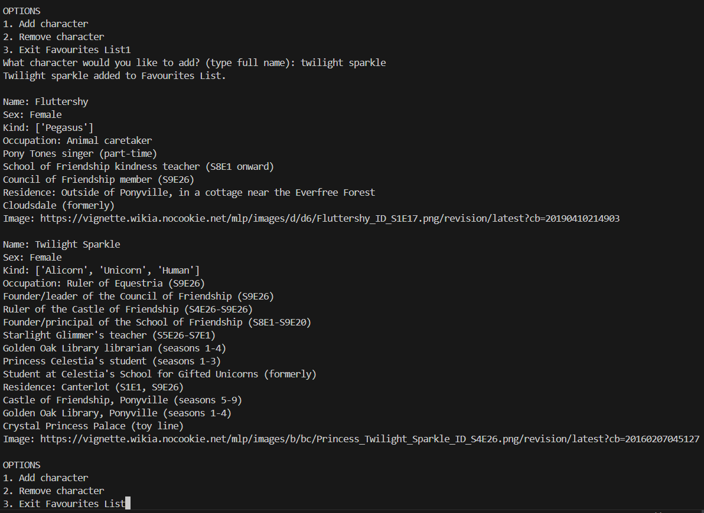
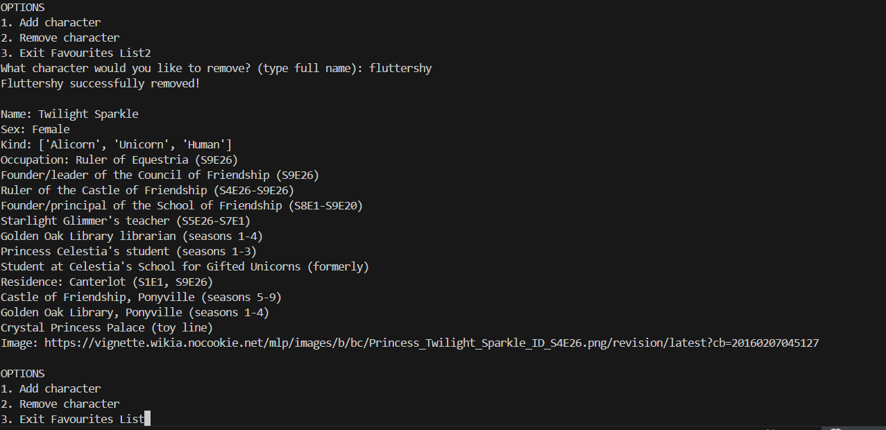
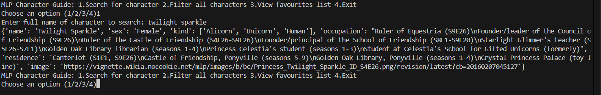
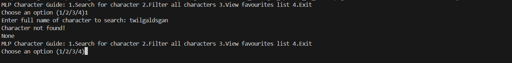
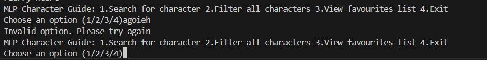
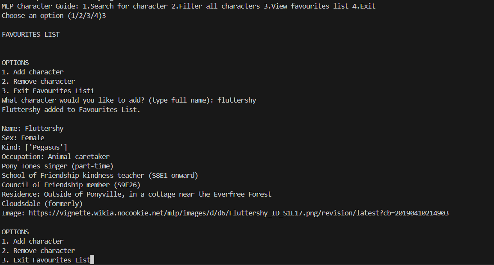

# MLP: Character Guide Application (Development Process)
Arisa Komatsu
## Requirements Definition
### Objective
To enable users to search for and sort characters in the animated series 'My Little Pony' by either gender or kind, providing general information on character traits like their alias, residence, occupation etc. This application aims to make MLP lore and information more readily available for the fandom without the need of constant web surfing.

### Functional Requirements
- **User Interface:** Should provide users with a list of action options with a textfield for users to enter their choice/input. 
- **Data Retrieval/Display:** System should be able to pull data from API and return it based on user commands. Users should be able to access character names, gender, residence, occupation and a profile image of all characters in My Little Pony.
- **User interaction:** System should allow users to search for characters by name, type or gender and create a personal collection of favourite characters.
- **Error processing:** System should be able to identify invalid inputs and respond with accurate and specific error messages.

### Non-Functional Requirements
- **Performance:** System should respond to user input quickly within 3 seconds and shouldn't bug out from invalid inputs or errors.
- **Usability:** System should be structured and clearly accessible for all users. The README file should also provide extensive assistance on using and navigating the project.
- **Reliability:** The API chosen for this project should contain accurate, reliable data on the My Little Pony Universe. Additionally, the system should be able to relay this data without faults. 
- **Security:** API key should be hidden to prevent data theft and unauthorised access. Should practise data minimisation.
- **Accessibility:** System should be easily navigated and usable for a range of abilities. README file should be able to explain how to use the system clearly and concisely.

## Determining Specification
### Functional Specifications
**User Requirements:**

The user needs to be able to select what information the system retrieves from the API and displays, whether it be a specific character or characters that align with a classification. There should be an input area where the user can type an input into the system to select an action based on the options displayed to the user.


**Inputs & Outputs:**

The system should accept user inputs in the form of strings and provide outputs such as data retrieved from the API (eg. name, residence, occupation, sex, type, image of character), system error messages and status codes.

**Core Features:**

- The system should allow users to search characters from My Little Pony by entering a character name and should retrieve the character data (eg. name, residence, occupation) from the external API, then process and display it in the form of a string to the user.
- The system should allow users to filter characters based on specific attributes (eg. sex, type)
- User should be able to add and remove characters from a dictionary that can be displayed to the user in the form of a string.


**User Interaction:**

Users will be provided with a command-line where they can type their course of action in text depending on the options they were given. Before each command line, the system will need to display to users what actions they can take, what to type to select each option and where users can type their input to ensure clear and easy navigation.

**Error Handling:**

System should minimise errors through proper validation and be able to handle invalid inputs without system failures or data loss, responding to users with clear, descriptive and user-friendly error messages that do not expose sensitive system information.


### Non-Functional Specifications

**Performance**

All system actions (eg. loading main menu, printing search results etc.) should occur within 2-3 seconds and navigating the project should feel natural and streamlined to users. We can ensure the program remains efficient by minimising unneccessary processing and ensuring that only the required data is retrieved from the API. The software should also minimise redudant and repetitive lines of code for most optimal maintainability, overall guaranteeing that users can experience a smooth, consistent and efficient interaction with the program even when multiple requests are made.

**Usability / Accessibility**

The application should overall be structured and easy to navigate. System messages and menu should be enclosed in boxed sections for visual structure, whereas user input fields should have a line above and below to emphasise where input is required. This makes the system more easily accessible to users. 

The main menu should be both logical and appealing to users, where options are clearly visible to promote accessibility. Users should be able to select their option easily with an understanding of what the option does and what results to expect.

After the system completes a user action, it should ask the user if they are done to clear the screen and reload the main menu for further actions and prevent a cluttered and confusing interface.

Furthermore, overall tone of system messages and menu should be very friendly and catering to the user and must maintain a warm character while giving clear and readable responses to boost overall user satisfaction. 

**Reliability**

What could perhaps not crash the whole system, but could be an issue and needs to be addressed? Data integrity? Duplicate data? API retrieval crash?

The system should be able to operate reliably when retrieving and displaying character data from the My Little Pony API. Potential issues such as failed API requests, duplicate data, or incomplete responses should be handled gracefully without causing the application to crash. Additionally, the program must maintain data integrity by ensuring that information retrieved from the API is processed and displayed accurately.

If the API cannot be reached or fails to return valid data, the system should display a clear, descriptive error message and allow the user to return to the main menu to retry request.

---
### Use Case #1: Search for a MLP character by name
**Actors:** User

**Preconditions:** 

- The application is running and the main menu is displayed to users
- API connection is functioning and contains all character data required
- The user is able to enter text into the command line

**Main Flow:** 

1. User selects 'search character' from the main menu via a string input in the command line.
2. The system prompts user to enter a character name.
3. User enters character name.
4. System sends request for data on character name from external API and API returns character data if found
5. System processes and extracts relevant character data(eg. sex, type, occupation, residence) and displays character information to user.
6. System reloads main menu for further interaction.

**Alternative Flows (if needed):** 

- **Invalid input:** If character is not found in API, the system will display an error message to the user displaying invalid input and that the character was not found.
- **API Request Failure:** If API cannot be reached or fails to retrieve data, the system will display an error message informing the user that the request could not be done and should return user to main menu.

**Postconditions:** 

- The information on the selected character is displayed to the user, or an appropriate error message will be displayed
- User will return to main menu and can continue interacting with the project

---
### Use Case #2: Filter MLP characters by attributes (sex/type)
**Actors:** User

**Preconditions:** 

- The application is running and the main menu is displayed to users
- API connection is functioning and contains all character data required
- The user is able to enter text into the command line

**Main Flow:** 

1. User selects 'filter characters' from the main menu via a string input in the command line.
2. The system displays to user main filter options (sex, type) and prompts user input
3. User selects a main filter.
4. System displays to user sub filter options within selected main filter and prompts user input
5. User selects a sub filter.
6. System sends request for data on selected sub filter from external API and API returns all characters who match the selected attribute
7. System processes and extracts relevant characters and displays their names to user.
6. System reloads main menu for further interaction. 

**Alternative Flows (if needed):** 

- **Invalid input:** If the user enters an invalid value, the system will return an error message stating invalid input and will return to main menu
- **No results found:** If no characters match the selected filter, the system updates user with a message stating that no results were found


**Postconditions:** 

- A filtered list of characters that fit the selected attribute is displayed and the user returns to the view favlist() loop

---
### Use Case #3: Add a character to the favlist() dictionary
**Actors:** User

**Preconditions:** 

- The application is running and the main menu is displayed to users
- API connection is functioning and contains all character data required
- The favlist() dictionary exists in the system
- The user is able to enter text into the command line
- The user has already selected the 'view Favourites List' option from the main menu

**Main Flow:** 

1. User selects 'add character' from the Favourites List menu via a string input in the command line.
2. The system prompts user to enter a character name.
3. User enters character name.
4. System checks if character is already in favlist()
5. If no, system sends request for data on character name from external API and API returns character data if found
5. System processes and extracts relevant character data(eg. sex, type, occupation, residence) and adds it to favlist().
6. System reloads favlist() and Favourites List menu for further interaction.

**Alternative Flows (if needed):** 

- **Character Found in favlist():** If the entered character is found in favlist(), system will return an error message stating the character is already in the dictionary and reprint the favlist()
- **Invalid input:** If entered character does not exist in API, system will return an error message stating the character does not exist and reprint the favlist()

**Postconditions:** 

- The selected character is removed from favlist()
- User returns to viewing favlist() loop

---
### Use Case #4: Remove a character from the favlist() dictionary
**Actors:** User

**Preconditions:** 

- The application is running and the main menu is displayed to users
- API connection is functioning and contains all character data required
- The favlist() dictionary exists in the system and contains at least one character
- The user is able to enter text into the command line
- The user has already selected the 'view Favourites List' option from the main menu

**Main Flow:** 

1. User selects 'remove character' from the Favourites List menu via a string input in the command line.
2. The system prompts user to enter a character name.
3. User enters character name.
4. System checks if character is in favlist() 
5. If yes, system removes character data from favlist() and sends a success message to user.
6. System reloads favlist() and Favourites List menu for further interaction.

**Alternative Flows (if needed):** 

- **Character Not Found in favlist():** If the entered character is not found in favlist(), system will return an error message stating the character was not found and reprint the favlist()
- **favlist() is empty:** If favlist() is empty, the system will return an error message stating the favlist() is empty and reprint the favlist()

**Postconditions:** 

- The selected character is removed from favlist()
- User returns to viewing favlist() loop

## Design
### Structure Chart

REDO AGAIN RIP
---
### Flowchart & Pseudocode
#### main()
```
BEGIN main()
    favlist = {}
    WHILE True
        DISPLAY "[MLP Character Guide!] 1.Search character 2.Sort characters 3.View favourites list 4.Exit"
        INPUT choice
        IF choice is 1 THEN
            DISPLAY 'What character would you like to search?: '
            INPUT name
            search_character(name)
        ELIF choice is 2 THEN
            sort_characters()
        ELIF choice is 3 THEN
            view_list()
        ELIF choice is 4 THEN
            DISPLAY 'Exiting program...'
            break
        ELSE
            DISPLAY 'Invalid input. Reloading Main Menu...'
        ENDIF

END main()
```

#### search_character()
```
BEGIN search_character(name)
    IF name is in API THEN
        DISPLAY name, sex, kind, residence, occupation, image
    ELSE
        DISPLAY "Invalid input. Character does not exist."
    ENDIF
END search_character(name)
```


#### filter_characters()
```
BEGIN filter_characters()
    DISPLAY 'What would you like to sort characters by? 1.Sex 2.Type'
    INPUT filter
    IF sort is 1 THEN
        DISPLAY 'Filter by: 1. Female 2. Male'
        INPUT sex
        IF sex is 1 THEN
            GET characters with sex = 'female' from API
        ELIF sex is 2 THEN
            GET characters with sex = 'male' from API
        ELSE
            DISPLAY "Invalid input. Choose either option 1 or 2. Returning to main menu...'
        ENDIF
    ELIF filter is 2 THEN
        DISPLAY 'Filter by: 1. Pegasus 2. Earth Pony 3. Unicorn 4. Other creatures'
        INPUT type
        IF type is 1 THEN
            GET characters with type = 'pegasus' from API
        ELIF type is 2 THEN
            GET characters with type = 'earth pony' from API
        ELIF type is 3 THEN
            GET characters with type = 'unicorn' from API
        ELIF type is 4 THEN
            GET characters where type is NOT pegasus, earth pony or unicorn from API
        ELSE
            DISPLAY 'Invalid input. Choose option between 1-4 (1/2/3/4). Returning to main menu...'
        ENDIF
    ELSE
        DISPLAY 'Invalid input. Choose option 1 or 2. Returning to main menu...'
    ENDIF
END filter_characters()
```


#### view_list()
```
BEGIN view_list()
    exit = False
    WHILE exit is False
        DISPLAY favlist()
        DISPLAY '1. Add character 2. Remove Character 3. Exit favourites list'
        INPUT choice
        IF choice is 1 THEN
            add_character()
        ELIF choice is 2 THEN
            remove_character()
        ELIF choice is 3 THEN
            DISPLAY 'Exiting favourites list...'
            exit = True
        ELSE 
            DISPLAY 'Invalid input. Choose a number between 1-3 (1/2/3). Reloading favourites list...
        ENDIF


END view_list()
```


#### add_character()
```
BEGIN add_character()
    DISPLAY 'What character would you like to add to favourites? : '
    INPUT character
    IF character is in favlist() THEN
        DISPLAY 'Character already in favourites.'
    ELIF character is in API THEN
        ADD character to favlist()
        DISPLAY 'Character successfully added!'
    ELSE
        DISPLAY 'Invalid input. Character does not exist.'
    ENDIF


END add_character()
```


#### remove_character()
```
BEGIN remove_character()
    DISPLAY 'What character would you like to remove from favourites? : '
    INPUT character
    IF character is in favlist() THEN
        DELETE character from favlist()
        DISPLAY 'Character successfully removed!'
    ELSE
        DISPLAY 'Invalid input. Character not found in list.'
    ENDIF
END remove_character()
```


---
### Data Dictionary
| Variable | Data Type | Format for Display | Size in Bytes | Size for Display | Description | Example | Validation |
|-|-|-|-|-|-|-|-|
|user_input | string | text | 50 | <50 characters | a | ```1``` | Must match one of the main menu options |
|character_name | string | text | 50 | <50 characters | Stores primary name of a character. | ```Twilight Sparkle``` | Cannot be empty | 
|character_gender | string | text | 10 | <10 characters | Stores gender of a character. | ```Female``` | Must be accurate to APi values (Male/Female) |
|character_kind | string/list | text | 50 | <50 characters | Stores species or type of a character. | ```["Unicorn", "Alicorn"]``` | Must be accurate to API values |
|character_residence | string | multiline text | 200 | <200 characters | Stores where a character lives. | ```Canterlot``` | Must be accurate to API values and may contain newline characters |
|character_occupation | string | multiline text | 300 | <300 characters | Stores the character's job or role. | ```Princess of Friendship``` | Optional if API field is missing |
|character_image | string(URL) | image | 255 | Image Displayed | Stores URL of an image of the character | ```https://vignette.wikia.nocookie.net/mlp/images/b/bc/Princess_Twilight_Sparkle_ID_S4E26.png/revision/latest?cb=20160207045127``` | Must be a valid image URL from API |
|filtered_characters | list | text | variable | n/a | Stores names of characters that match selected filter. | ```["Twilight Sparkle", "Pinkie Pie"]``` | No duplicate characters |
|favlist | dictionary | structured data | variable | variable | Stores user's favourite characters and their data. | ```{ "Twilight Sparkle": {...} }``` | No duplicate character data |

---
### Gantt Chart

## Development
### Evaluation of Functioning Program
The functioning program I have created so far overall completes what it is required to do, with all functions working without errors. It also responds with proper responses to user input/API errors gracefully without crashing the application, so overall in terms the functional requirements, this prototype is quite decent.

**Examples Interactions**







However, in terms of usability, the main menu lacks a help option (which is a requirement in the assessment task) and lacks clarity in the interface as there is no clear structure or breaks, hindering readability and making the application hard to navigate. 

As you can see in the below image, some data from the favlist() dictionary or the API are still contained in [] and '' when displayed to users, and although it doesn't stop the program from functioning, it just makes the UX more unappealing for users. Additionally, the images of characters aren't properly displayed in the program but rather users are given a URL link to the image, which just makes information less accessible just within the interface. The purpose of this application is for users to be able to access all general character information WITHIN the application, so the system should be able to display the image within VSC for the sake of the users' convenience.



Overall, there are just generally a plethora of small inconsistencies and distinct lack of structure in the interface that ultimately negatively impact the user experience. Although this prototype does comply to the functional requirements, I believe significant consideration to this project's non-functional requirements is required for a positive UX to be delivered and this project to be successful.

## Integration
## Testing and Debugging
### Student Feedback #1 - Yuna Shin
- feedback based on functional and nonfunctional requirements, response time, load testing and the suitability of the requirements.txt and README.md file

### Student Feedback #2 - Isabella Usacheva
- feedback based on functional and nonfunctional requirements, response time, load testing and the suitability of the requirements.txt and README.md file

## Maintenance
