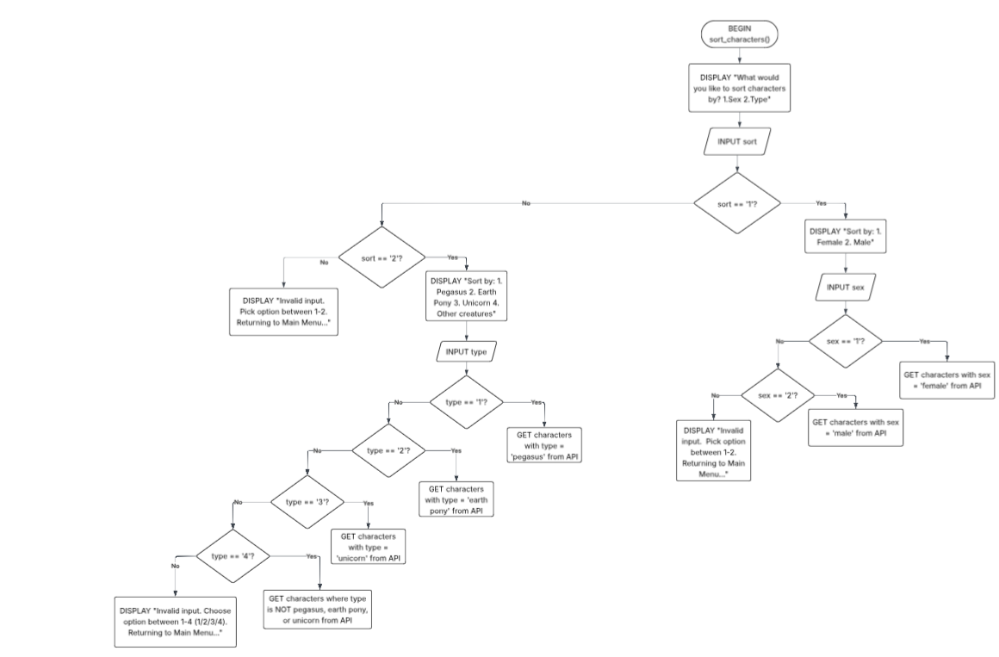

# MLP: Character Guide Application (Development Process)
Arisa Komatsu
## Requirements Definition
### Objective
To enable users to search for and sort characters in the animated series 'My Little Pony' by either gender or kind, providing general information on character traits like their alias, residence, occupation etc. This application aims to make MLP lore and information more readily available for the fandom without the need of constant web surfing.

### Functional Requirements
- **User Interface:** Should provide users with a list of action options with a textfield for users to enter their choice/input. 
- **Data Retrieval/Display:** System should be able to pull data from API and return it based on user commands. Users should be able to access character names, gender, residence, occupation and a profile image of all characters in My Little Pony.
- **User interaction:** System should allow users to search for characters by name, type or gender and create a personal collection of favourite characters.
- **Error processing:** System should be able to identify invalid inputs and respond with accurate and specific error messages.

### Non-Functional Requirements
- **Performance:** System should respond to user input quickly within 3 seconds and shouldn't bug out from invalid inputs or errors.
- **Usability:** System should be structured and clearly accessible for all users. The README file should also provide extensive assistance on using and navigating the project.
- **Reliability:** The API chosen for this project should contain accurate, reliable data on the My Little Pony Universe. Additionally, the system should be able to relay this data without faults. 
- **Security:** API key should be hidden to prevent data theft and unauthorised access. Should practise data minimisation.
- **Accessibility:** System should be easily navigated and usable for a range of abilities. README file should be able to explain how to use the system clearly and concisely.

## Determining Specification
### Functional Specifications
**User Requirements:**

The user needs to be able to select what information the system retrieves from the API and displays, whether it be a specific character or characters that align with a classification. There should be an input area where the user can type an input into the system to select an action based on the options displayed to the user.


**Inputs & Outputs:**

The system should accept user inputs in the form of strings and provide outputs such as data retrieved from the API (eg. name, residence, occupation, sex, type, image of character), system error messages and status codes.

**Core Features:**

- The system should allow users to search characters from My Little Pony by entering a character name and should retrieve the character data (eg. name, residence, occupation) from the external API, then process and display it in the form of a string to the user.
- The system should allow users to filter characters based on specific attributes (eg. sex, type)
- User should be able to add and remove characters from a dictionary that can be displayed to the user in the form of a string.


**User Interaction:**

Users will be provided with a command-line where they can type their course of action in text depending on the options they were given. Before each command line, the system will need to display to users what actions they can take, what to type to select each option and where users can type their input to ensure clear and easy navigation.

**Error Handling:**

System should minimise errors through proper validation and be able to handle invalid inputs without system failures or data loss, responding to users with clear, descriptive and user-friendly error messages that do not expose sensitive system information.


### Non-Functional Specifications

**Performance**

All system actions (eg. loading main menu, printing search results etc.) should occur within 2-3 seconds and navigating the project should feel natural and streamlined to users. We can ensure the program remains efficient by minimising unneccessary processing and ensuring that only the required data is retrieved from the API. The software should also minimise redudant and repetitive lines of code for most optimal maintainability, overall guaranteeing that users can experience a smooth, consistent and efficient interaction with the program even when multiple requests are made.

**Usability / Accessibility**

The application should overall be structured and easy to navigate. System messages and menu should be enclosed in boxed sections for visual structure, whereas user input fields should have a line above and below to emphasise where input is required. This makes the system more easily accessible to users. 

The main menu should be both logical and appealing to users, where options are clearly visible to promote accessibility. Users should be able to select their option easily with an understanding of what the option does and what results to expect.

After the system completes a user action, it should ask the user if they are done to clear the screen and reload the main menu for further actions and prevent a cluttered and confusing interface.

Furthermore, overall tone of system messages and menu should be very friendly and catering to the user and must maintain a warm character while giving clear and readable responses to boost overall user satisfaction. 

**Reliability**

What could perhaps not crash the whole system, but could be an issue and needs to be addressed? Data integrity? Duplicate data? API retrieval crash?

The system should be able to operate reliably when retrieving and displaying character data from the My Little Pony API. Potential issues such as failed API requests, duplicate data, or incomplete responses should be handled gracefully without causing the application to crash. Additionally, the program must maintain data integrity by ensuring that information retrieved from the API is processed and displayed accurately.

If the API cannot be reached or fails to return valid data, the system should display a clear, descriptive error message and allow the user to return to the main menu to retry request.

---
### Use Case #1: Search for a MLP character by name
**Actors:** User

**Preconditions:** 

Conditions that must be met before the use case starts.

**Main Flow:** 

The step-by-step process of how the interaction occurs.

**Alternative Flows (if needed):** 

Variations or exceptions to the main flow.

**Postconditions:** 

The expected outcome or result after the use case is completed.

---
### Use Case #2: Filter MLP characters by attributes (sex/type)
**Actors:** User

**Preconditions:** 

Conditions that must be met before the use case starts.

**Main Flow:** 

The step-by-step process of how the interaction occurs.

**Alternative Flows (if needed):** 

Variations or exceptions to the main flow.

**Postconditions:** 

The expected outcome or result after the use case is completed.

---
### Use Case #3: Add a character to the favlist() dictionary
**Actors:** User

**Preconditions:** 

Conditions that must be met before the use case starts.

**Main Flow:** 

The step-by-step process of how the interaction occurs.

**Alternative Flows (if needed):** 

Variations or exceptions to the main flow.

**Postconditions:** 

The expected outcome or result after the use case is completed.

---
### Use Case #4: Remove a character from the favlist() dictionary
**Actors:** User

**Preconditions:** 

Conditions that must be met before the use case starts.

**Main Flow:** 

The step-by-step process of how the interaction occurs.

**Alternative Flows (if needed):** 

Variations or exceptions to the main flow.

**Postconditions:** 

The expected outcome or result after the use case is completed.

## Design
### Structure Chart


---
### Flowchart & Pseudocode
#### main()
```
BEGIN main()
    favlist = {}
    WHILE True
        DISPLAY "[MLP Character Guide!] 1.Search character 2.Sort characters 3.View favourites list 4.Exit"
        INPUT choice
        IF choice is 1 THEN
            DISPLAY 'What character would you like to search?: '
            INPUT name
            search_character(name)
        ELIF choice is 2 THEN
            sort_characters()
        ELIF choice is 3 THEN
            view_list()
        ELIF choice is 4 THEN
            DISPLAY 'Exiting program...'
            break
        ELSE
            DISPLAY 'Invalid input. Reloading Main Menu...'
        ENDIF

END main()
```

#### search_character()
```
BEGIN search_character(name)
    IF name is in API THEN
        DISPLAY name, sex, kind, residence, occupation, image
    ELSE
        DISPLAY "Invalid input. Character does not exist."
    ENDIF
END search_character(name)
```


#### sort_characters()
```
BEGIN sort_characters()
    DISPLAY 'What would you like to sort characters by? 1.Sex 2.Type'
    INPUT sort
    IF sort is 1 THEN
        DISPLAY 'Sort by: 1. Female 2. Male'
        INPUT sex
        IF sex is 1 THEN
            GET characters with sex = 'female' from API
        ELIF sex is 2 THEN
            GET characters with sex = 'male' from API
        ELSE
            DISPLAY "Invalid input. Choose either option 1 or 2. Returning to main menu...'
        ENDIF
    ELIF sort is 2 THEN
        DISPLAY 'Sort by: 1. Pegasus 2. Earth Pony 3. Unicorn 4. Other creatures'
        INPUT type
        IF type is 1 THEN
            GET characters with type = 'pegasus' from API
        ELIF type is 2 THEN
            GET characters with type = 'earth pony' from API
        ELIF type is 3 THEN
            GET characters with type = 'unicorn' from API
        ELIF type is 4 THEN
            GET characters where type is NOT pegasus, earth pony or unicorn from API
        ELSE
            DISPLAY 'Invalid input. Choose option between 1-4 (1/2/3/4). Returning to main menu...'
        ENDIF
    ELSE
        DISPLAY 'Invalid input. Choose option 1 or 2. Returning to main menu...'
    ENDIF
END sort_characters()
```


#### view_list()
```
BEGIN view_list()
    exit = False
    WHILE exit is False
        DISPLAY favlist()
        DISPLAY '1. Add character 2. Remove Character 3. Exit favourites list'
        INPUT choice
        IF choice is 1 THEN
            add_character()
        ELIF choice is 2 THEN
            remove_character()
        ELIF choice is 3 THEN
            DISPLAY 'Exiting favourites list...'
            exit = True
        ELSE 
            DISPLAY 'Invalid input. Choose a number between 1-3 (1/2/3). Reloading favourites list...
        ENDIF


END view_list()
```


#### add_character()
```
BEGIN add_character()
    DISPLAY 'What character would you like to add to favourites? : '
    INPUT character
    IF character is in favlist() THEN
        DISPLAY 'Character already in favourites.'
    ELIF character is in API THEN
        ADD character to favlist()
        DISPLAY 'Character successfully added!'
    ELSE
        DISPLAY 'Invalid input. Character does not exist.'
    ENDIF


END add_character()
```


#### remove_character()
```
BEGIN remove_character()
    DISPLAY 'What character would you like to remove from favourites? : '
    INPUT character
    IF character is in favlist() THEN
        DELETE character from favlist()
        DISPLAY 'Character successfully removed!'
    ELSE
        DISPLAY 'Invalid input. Character not found in list.'
    ENDIF
END remove_character()
```


---
### Data Dictionary
| Variable | Data Type | Format for Display | Size in Bytes | Size for Display | Description | Example | Validation |
| |-|-|-|-|-|-|-|

---
### Gantt Chart

## Development
## Integration
## Testing and Debugging
### Student Feedback #1 - Yuna Shin
- feedback based on functional and nonfunctional requirements, response time, load testing and the suitability of the requirements.txt and README.md file

### Student Feedback #2 - Isabella Usacheva
- feedback based on functional and nonfunctional requirements, response time, load testing and the suitability of the requirements.txt and README.md file

## Maintenance
Evaluate the role that maintenance would play in the continued implementation of this software 