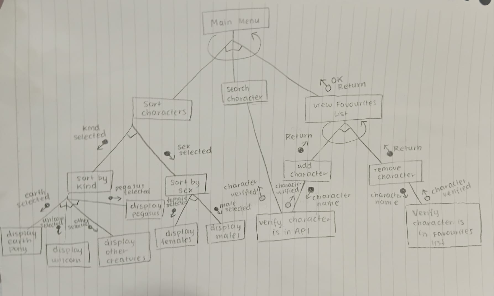

# MLP: Character Guide Application (Development Process)
Arisa Komatsu
## Requirements Definition
### Objective
To enable users to search for and sort characters in the animated series 'My Little Pony' by either gender or kind, providing general information on character traits like their alias, residence, occupation etc. This application aims to make MLP lore and information more readily available for the fandom without the need of constant web surfing.

### Functional Requirements
- **User Interface:** Should provide users with a list of action options with a textfield for users to enter their choice/input. 
- **Data Retrieval/Display:** System should be able to pull data from API and return it based on user commands. Users should be able to access character names, gender, residence, occupation and a profile image of all characters in My Little Pony.
- **User interaction:** System should allow users to search for characters by name, type or gender and create a personal collection of favourite characters.
- **Error processing:** System should be able to identify invalid inputs and respond with accurate and specific error messages.

### Non-Functional Requirements
- **Performance:** System should respond to user input quickly within 3 seconds and shouldn't bug out from invalid inputs or errors.
- **Usability:** System should be structured and clearly accessible for all users. The README file should also provide extensive assistance on using and navigating the project.
- **Reliability:** The API chosen for this project should contain accurate, reliable data on the My Little Pony Universe. Additionally, the system should be able to relay this data without faults. 
- **Security:** API key should be hidden to prevent data theft and unauthorised access. Should practise data minimisation.
- **Accessibility:** System should be easily navigated and usable for a range of abilities. README file should be able to explain how to use the system clearly and concisely.

## Determining Specification
### Functional Specifications
### Non-Functional Specifications
**Wording of messages:** 

Overall tone of system messages and menu should be very friendly and catering to the user and must maintain a warm character while giving clear and readable responses. 

**Main Menu:** 

Main menu should be both well structured and aesthetically pleasing with small embellishments to lean into the fantasy genre of My Little Pony. The menu options should be cleary visible, and easy to select. Users should be able to select their option easily with an understanding of what the option does and what results they should expect.

**Frames:** 

System messages and menus should be enclosed in a box with visual structure, whereas user input fields should have a line above and below for emphasis.

**Timing:**

 All system actions (eg. loading main menu, printing search results etc.) should occur within 2-3 seconds and navigating the project should feel natural and streamlined to users.

**Clearing screen:**

 After the system completes a user action, it should ask the user if they are done to clear the screen and reload the main menu for further actions and prevent a cluttered and confusing interface.

## Design
### Structure Chart


---
### Flowchart
#### main()
#### sort_characters()
#### view_list()
#### add_character()
#### remove_character()
---
### Pseudocode
#### main()
```aaaaa```
#### sort_characters()
```aaaa```
#### view_list()
```aaa```
#### add_character()
```aaa```
#### remove_character()
```aaa```

---
### Data Dictionary
| Variable | Data Type | Format for Display | Size in Bytes | Size for Display | Description | Example | Validation |
|-|-|-|-|-|-|-|-|

---
### Gantt Chart

## Development
## Integration
## Testing and Debugging
### Student Feedback #1 - Yuna Shin
- feedback based on functional and nonfunctional requirements, response time, load testing and the suitability of the requirements.txt and README.md file

### Student Feedback #2 - Isabella Usacheva
- feedback based on functional and nonfunctional requirements, response time, load testing and the suitability of the requirements.txt and README.md file

## Maintenance
Evaluate the role that maintenance would play in the continued implementation of this software 