# MLP: Character Guide Application (Development Process)
Arisa Komatsu
## Requirements Definition
### Objective
To enable users to search for and sort characters in the animated series 'My Little Pony' by either gender or kind, providing general information on character traits like their alias, residence, occupation etc. This application aims to make MLP lore and information more readily available for the fandom without the need of constant web surfing.

### Functional Requirements
- **User Interface:** Should provide users with a list of action options with a textfield for users to enter their choice/input. 
- **Data Retrieval/Display:** System should be able to pull data from API and return it based on user commands. Users should be able to access character names, gender, residence, occupation and a profile image of all characters in My Little Pony.
- **User interaction:** System should allow users to search for characters by name, type or gender and create a personal collection of favourite characters.
- **Error processing:** System should be able to identify invalid inputs and respond with accurate and specific error messages.

### Non-Functional Requirements
- **Performance:** System should respond to user input quickly within 3 seconds and shouldn't bug out from invalid inputs or errors.
- **Usability:** System should be structured and clearly accessible for all users. The README file should also provide extensive assistance on using and navigating the project.
- **Reliability:** The API chosen for this project should contain accurate, reliable data on the My Little Pony Universe. Additionally, the system should be able to relay this data without faults. 
- **Security:** API key should be hidden to prevent data theft and unauthorised access. Should practise data minimisation.
- **Accessibility:** System should be easily navigated and usable for a range of abilities. README file should be able to explain how to use the system clearly and concisely.

## Determining Specification
### Functional Specifications
**User Requirements:**

The user needs to be able to select what information the system retrieves from the API and displays, whether it be a specific character or characters that align with a classification. There should be an input area where the user can type an input into the system to select an action based on the options displayed to the user.


**Inputs & Outputs:**

The system should accept user inputs in the form of strings and provide outputs such as data retrieved from the API (eg. name, residence, occupation, sex, type, image of character), system error messages and status codes.

**Core Features:**

- The system should allow users to search characters from My Little Pony by entering a character name and should retrieve the character data (eg. name, residence, occupation) from the external API, then process and display it in the form of a string to the user.
- The system should allow users to filter characters based on specific attributes (eg. sex, type)
- User should be able to add and remove characters from a dictionary that can be displayed to the user in the form of a string.


**User Interaction:**

Users will be provided with a command-line where they can type their course of action in text depending on the options they were given. Before each command line, the system will need to display to users what actions they can take, what to type to select each option and where users can type their input to ensure clear and easy navigation.

**Error Handling:**

System should minimise errors through proper validation and be able to handle invalid inputs without system failures or data loss, responding to users with clear, descriptive and user-friendly error messages that do not expose sensitive system information.


### Non-Functional Specifications

**Performance**

All system actions (eg. loading main menu, printing search results etc.) should occur within 2-3 seconds and navigating the project should feel natural and streamlined to users. We can ensure the program remains efficient by minimising unneccessary processing and ensuring that only the required data is retrieved from the API. The software should also minimise redudant and repetitive lines of code for most optimal maintainability, overall guaranteeing that users can experience a smooth, consistent and efficient interaction with the program even when multiple requests are made.

**Usability / Accessibility**

The application should overall be structured and easy to navigate. System messages and menu should be enclosed in boxed sections for visual structure, whereas user input fields should have a line above and below to emphasise where input is required. This makes the system more easily accessible to users. 

The main menu should be both logical and appealing to users, where options are clearly visible to promote accessibility. Users should be able to select their option easily with an understanding of what the option does and what results to expect.

After the system completes a user action, it should ask the user if they are done to clear the screen and reload the main menu for further actions and prevent a cluttered and confusing interface.

Furthermore, overall tone of system messages and menu should be very friendly and catering to the user and must maintain a warm character while giving clear and readable responses to boost overall user satisfaction. 

**Reliability**

What could perhaps not crash the whole system, but could be an issue and needs to be addressed? Data integrity? Duplicate data? API retrieval crash?

The system should be able to operate reliably when retrieving and displaying character data from the My Little Pony API. Potential issues such as failed API requests, duplicate data, or incomplete responses should be handled gracefully without causing the application to crash. Additionally, the program must maintain data integrity by ensuring that information retrieved from the API is processed and displayed accurately.

If the API cannot be reached or fails to return valid data, the system should display a clear, descriptive error message and allow the user to return to the main menu to retry request.

---
### Use Case #1: Search for a MLP character by name
**Actors:** User

**Preconditions:** 

- The application is running and the main menu is displayed to users
- API connection is functioning and contains all character data required
- The user is able to enter text into the command line

**Main Flow:** 

1. User selects 'search character' from the main menu via a string input in the command line.
2. The system prompts user to enter a character name.
3. User enters character name.
4. System sends request for data on character name from external API and API returns character data if found
5. System processes and extracts relevant character data(eg. sex, type, occupation, residence) and displays character information to user.
6. System reloads main menu for further interaction.

**Alternative Flows (if needed):** 

- **Invalid input:** If character is not found in API, the system will display an error message to the user displaying invalid input and that the character was not found.
- **API Request Failure:** If API cannot be reached or fails to retrieve data, the system will display an error message informing the user that the request could not be done and should return user to main menu.

**Postconditions:** 

- The information on the selected character is displayed to the user, or an appropriate error message will be displayed
- User will return to main menu and can continue interacting with the project

---
### Use Case #2: Filter MLP characters by attributes (sex/type)
**Actors:** User

**Preconditions:** 

- The application is running and the main menu is displayed to users
- API connection is functioning and contains all character data required
- The user is able to enter text into the command line

**Main Flow:** 

1. User selects 'filter characters' from the main menu via a string input in the command line.
2. The system displays to user main filter options (sex, type) and prompts user input
3. User selects a main filter.
4. System displays to user sub filter options within selected main filter and prompts user input
5. User selects a sub filter.
6. System sends request for data on selected sub filter from external API and API returns all characters who match the selected attribute
7. System processes and extracts relevant characters and displays their names to user.
6. System reloads main menu for further interaction. 

**Alternative Flows (if needed):** 

- **Invalid input:** If the user enters an invalid value, the system will return an error message stating invalid input and will return to main menu
- **No results found:** If no characters match the selected filter, the system updates user with a message stating that no results were found


**Postconditions:** 

- A filtered list of characters that fit the selected attribute is displayed and the user returns to the view favlist() loop

---
### Use Case #3: Add a character to the favlist() dictionary
**Actors:** User

**Preconditions:** 

- The application is running and the main menu is displayed to users
- API connection is functioning and contains all character data required
- The favlist() dictionary exists in the system
- The user is able to enter text into the command line
- The user has already selected the 'view Favourites List' option from the main menu

**Main Flow:** 

1. User selects 'add character' from the Favourites List menu via a string input in the command line.
2. The system prompts user to enter a character name.
3. User enters character name.
4. System checks if character is already in favlist()
5. If no, system sends request for data on character name from external API and API returns character data if found
5. System processes and extracts relevant character data(eg. sex, type, occupation, residence) and adds it to favlist().
6. System reloads favlist() and Favourites List menu for further interaction.

**Alternative Flows (if needed):** 

- **Character Found in favlist():** If the entered character is found in favlist(), system will return an error message stating the character is already in the dictionary and reprint the favlist()
- **Invalid input:** If entered character does not exist in API, system will return an error message stating the character does not exist and reprint the favlist()

**Postconditions:** 

- The selected character is removed from favlist()
- User returns to viewing favlist() loop

---
### Use Case #4: Remove a character from the favlist() dictionary
**Actors:** User

**Preconditions:** 

- The application is running and the main menu is displayed to users
- API connection is functioning and contains all character data required
- The favlist() dictionary exists in the system and contains at least one character
- The user is able to enter text into the command line
- The user has already selected the 'view Favourites List' option from the main menu

**Main Flow:** 

1. User selects 'remove character' from the Favourites List menu via a string input in the command line.
2. The system prompts user to enter a character name.
3. User enters character name.
4. System checks if character is in favlist() 
5. If yes, system removes character data from favlist() and sends a success message to user.
6. System reloads favlist() and Favourites List menu for further interaction.

**Alternative Flows (if needed):** 

- **Character Not Found in favlist():** If the entered character is not found in favlist(), system will return an error message stating the character was not found and reprint the favlist()
- **favlist() is empty:** If favlist() is empty, the system will return an error message stating the favlist() is empty and reprint the favlist()

**Postconditions:** 

- The selected character is removed from favlist()
- User returns to viewing favlist() loop

## Design
### Structure Chart
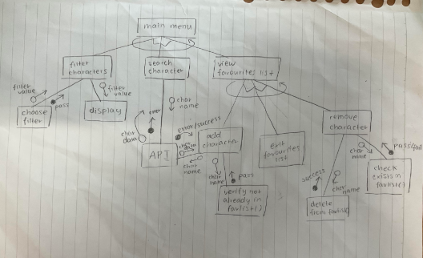
REDO AGAIN RIP
---
### Flowchart & Pseudocode
#### main()
```
BEGIN main()
    CREATE log_df as a dictionary
    CREATE favlist as a dictionary
    WHILE True
        DISPLAY "[MLP Character Guide!] 1.Search character 2.Sort characters 3.View favourites list 4.View user interactions log 5.Exit"
        INPUT choice
        IF choice is 1 THEN
            DISPLAY 'What character would you like to search?: '
            INPUT name
            search_character(name)
        ELIF choice is 2 THEN
            sort_characters()
        ELIF choice is 3 THEN
            view_list()
        ELIF choice is 4 THEN
            DISPLAY log
        ELIF choice is 5 THEN
            DISPLAY 'Exiting program...'
            break
        ELSE
            DISPLAY 'Invalid input. Reloading Main Menu...'
        ENDIF

END main()
```
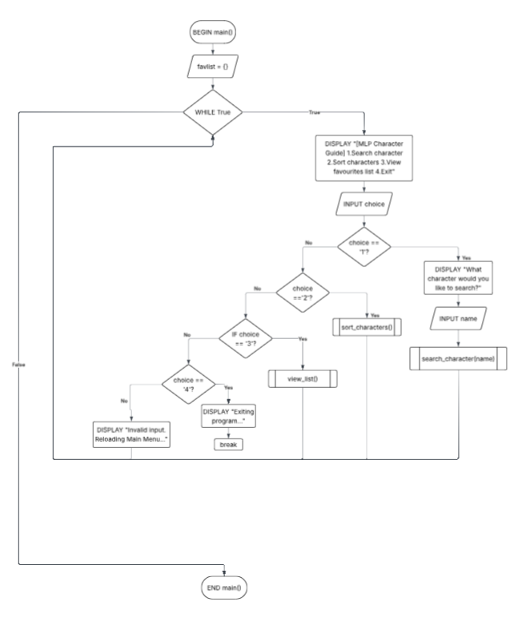
#### search_character()
```
BEGIN search_character(name)
    IF name is in API THEN
        DISPLAY name, sex, kind, residence, occupation, image
    ELSE
        DISPLAY "Invalid input. Character does not exist."
    ENDIF
END search_character(name)
```
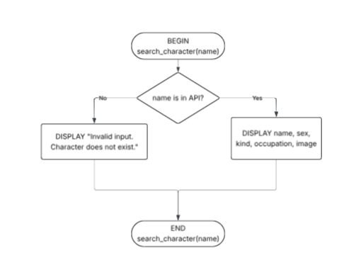

#### filter_characters()
```
BEGIN filter_characters()
    DISPLAY 'What would you like to sort characters by? 1.Sex 2.Type'
    INPUT filter
    IF sort is 1 THEN
        DISPLAY 'Filter by: 1. Female 2. Male'
        INPUT sex
        IF sex is 1 THEN
            DISPLAY characters with sex = 'female' from API
        ELIF sex is 2 THEN
            DISPLAY characters with sex = 'male' from API
        ELSE
            DISPLAY "Invalid input. Choose either option 1 or 2. Returning to main menu...'
        ENDIF
    ELIF filter is 2 THEN
        DISPLAY 'Filter by: 1. Pegasus 2. Earth Pony 3. Unicorn 4. Other creatures'
        INPUT type
        IF type is 1 THEN
            DISPLAY characters with 'pegasus' in 'kind' from API
        ELIF type is 2 THEN
            DISPLAY characters with 'earth pony' in 'kind' from API
        ELIF type is 3 THEN
            DISPLAY characters with 'unicorn' in 'kind' from API
        ELIF type is 4 THEN
            DISPLAY characters with 'alicorn' in 'kind' from API
        ELIF type is 5 THEN
            DISPLAY characters where 'kind' is NOT pegasus, earth pony, unicorn or alicorn from API
        ELSE
            DISPLAY 'Invalid input. Choose option between 1-5 (1/2/3/4/5). Returning to main menu...'
        ENDIF
    ELSE
        DISPLAY 'Invalid input. Choose option 1 or 2. Returning to main menu...'
    ENDIF
END filter_characters()
```
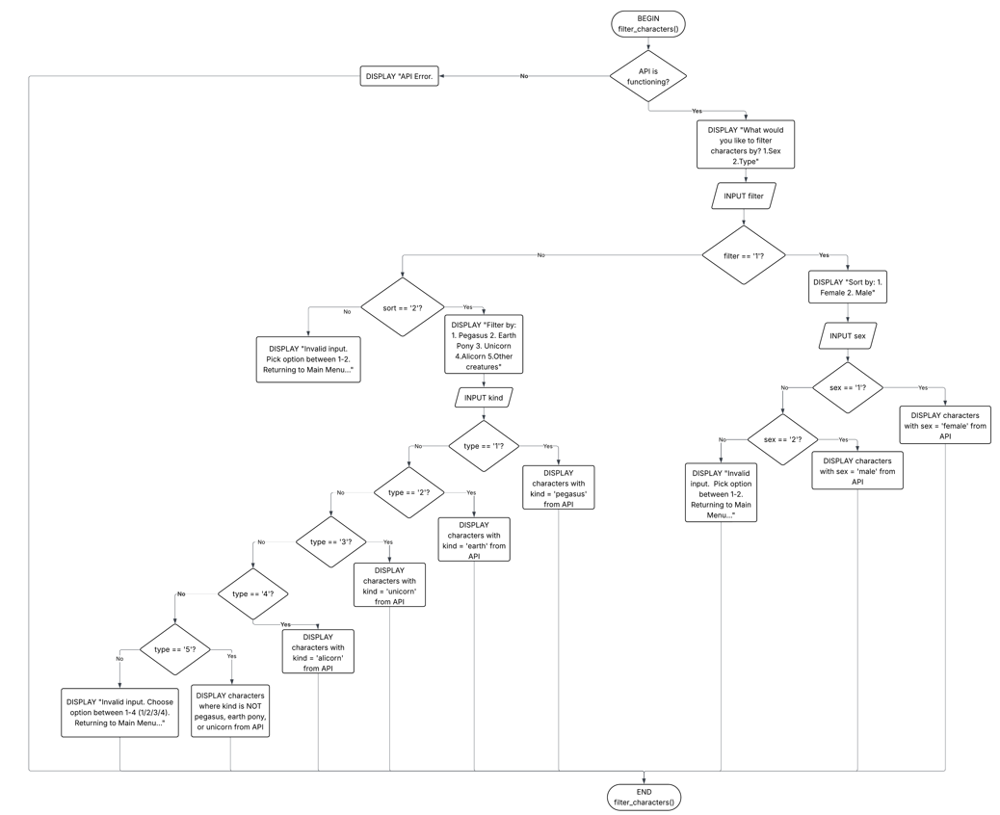

#### view_list()
```
BEGIN view_list()
    exit = False
    WHILE exit is False
        IF favlist is empty THEN
            DISPLAY 'Favourites List is empty!'
        ELSE
            DISPLAY favlist
        ENDIF
        DISPLAY '1. Add character 2. Remove Character 3. Exit favourites list'
        INPUT choice
        IF choice is 1 THEN
            add_character()
        ELIF choice is 2 THEN
            remove_character()
        ELIF choice is 3 THEN
            DISPLAY 'Exiting favourites list...'
            exit = True
        ELSE 
            DISPLAY 'Invalid input. Choose a number between 1-3 (1/2/3). Reloading favourites list...
        ENDIF


END view_list()
```
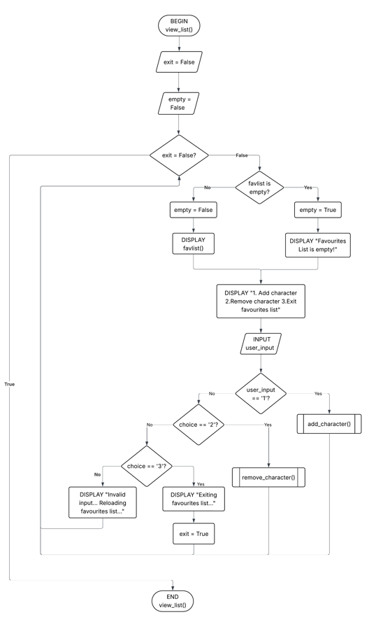

#### add_character()
```
BEGIN add_character()
    DISPLAY 'What character would you like to add to favourites? : '
    INPUT character
    IF character is in favlist() THEN
        DISPLAY 'Character already in favourites.'
    ELIF character is in API THEN
        ADD character to favlist()
        DISPLAY 'Character successfully added!'
    ELSE
        DISPLAY 'Invalid input. Character does not exist.'
    ENDIF


END add_character()
```
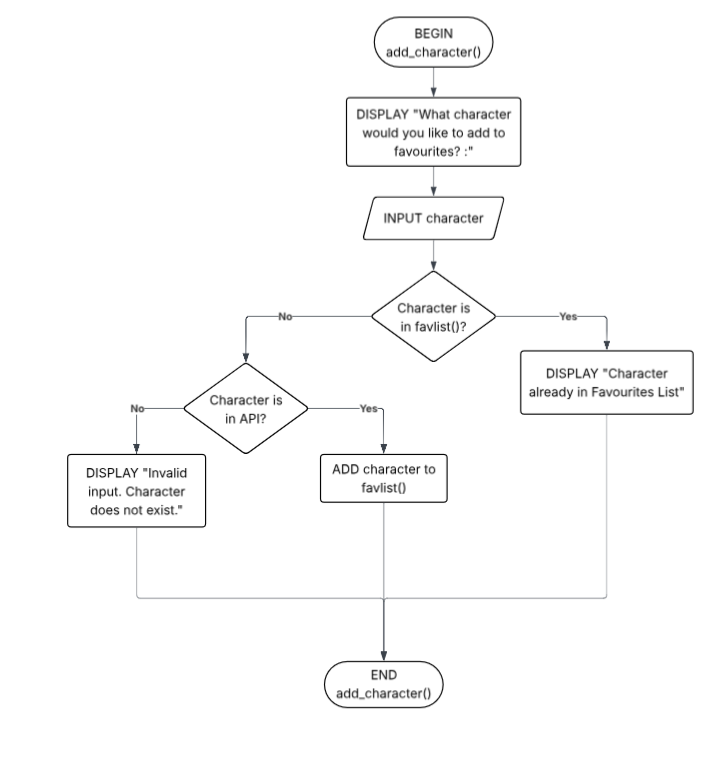

#### remove_character()
```
BEGIN remove_character()
    DISPLAY 'What character would you like to remove from favourites? : '
    INPUT character
    IF character is in favlist() THEN
        DELETE character from favlist()
        DISPLAY 'Character successfully removed!'
    ELSE
        DISPLAY 'Invalid input. Character not found in list.'
    ENDIF
END remove_character()
```
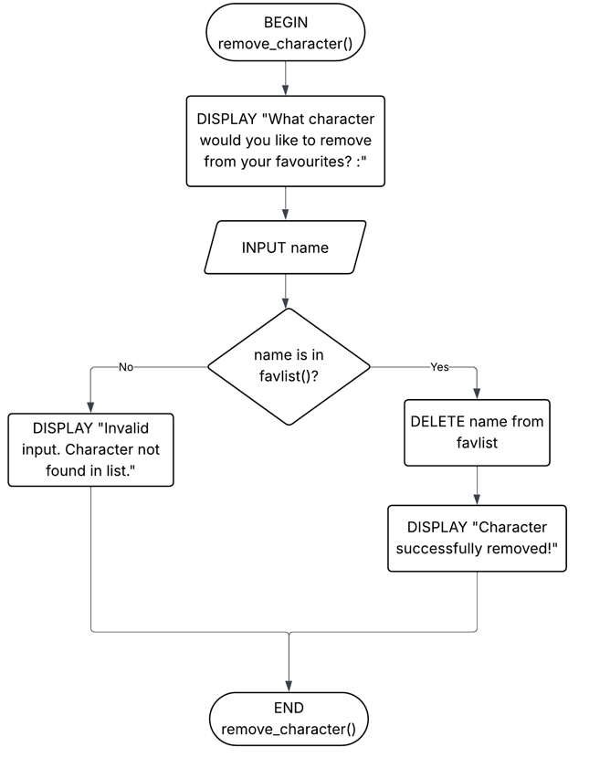

#### record_actions()
```
BEGIN record_actions(action, details)
    SET timestamp to current time
    CREATE new_row as a dictionary WITH timestamp, action, details
    ADD new_row to log_df
END record_actions(action, details)
```

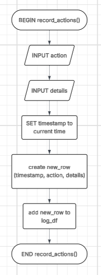
---
### Data Dictionary
| Variable | Data Type | Format for Display | Size in Bytes | Size for Display | Description | Example | Validation |
|-|-|-|-|-|-|-|-|
|user_input | string | text | 50 | <50 characters | a | ```1``` | Must match expected options for the current menu OR 'h' for help |
|Name | string | text | 50 | <50 characters | Stores primary name of a character. | ```Twilight Sparkle``` | Cannot be empty | 
|Gender | string | text | 10 | <10 characters | Stores gender of a character. | ```Female``` | Must be retrieved directly from API + expected values "Male" or "Female" |
|Kind | string | text | 50 | <50 characters | Stores species or type of a character. | ```Unicorn``` | Must be accurate to API values |
|Residence | string | text | 200 | <200 characters | Stores where a character lives. | ```Canterlot``` | Must be accurate to API values and may contain newline characters |
|Occupation | string | text | 300 | <300 characters | Stores the character's job or role. | ```Princess of Friendship``` | Optional if API field is missing |
|Image | string(URL) | image | 255 | Image Displayed | Stores URL of an image of the character | ```https://vignette.wikia.nocookie.net/mlp/images/b/bc/Princess_Twilight_Sparkle_ID_S4E26.png/revision/latest?cb=20160207045127``` | Must be a valid image URL from API or None if no image available |
|favlist | dictionary | structured data | variable | variable | Stores user's favourite characters and their data. | ```{ "Twilight Sparkle": {...} }``` | No duplicate character data |
| log_df | DataFrame | table | dynamic | displayed table | Stores user interaction logs | 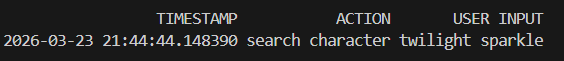 | No null timestamp |

---
### Gantt Chart
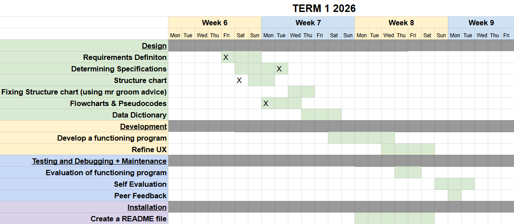
## Development
### Evaluation of Functioning Program
The functioning program I have created so far overall completes what it is required to do, with all IF statement options working without any big errors as there is no API or modules incorporated yet (these IF statements will later call functions). It also responds with proper responses to user input errors gracefully without crashing the application, so overall in terms the functional requirements, this prototype is quite decent.

**User input error Handling Example**

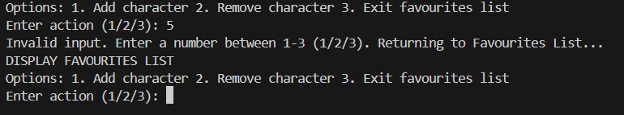

However, in terms of usability, the main menu lacks a help option (which is a requirement in the assessment task) and lacks clarity in the interface as there is no clear structure or line breaks, hindering readability and making the application hard to navigate. This can be seen in the below UX examples.

**Examples Interactions**

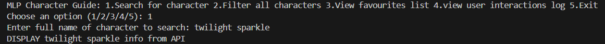
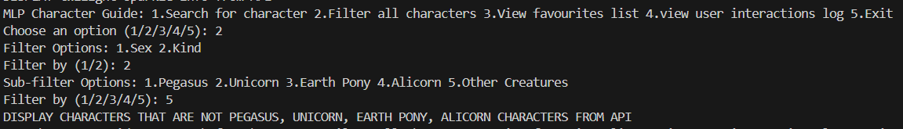
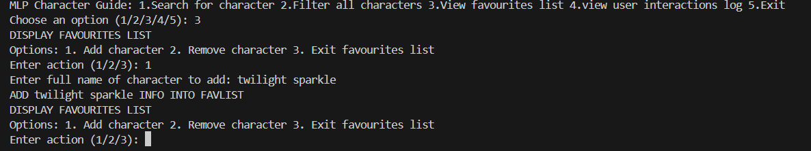
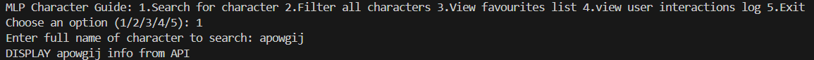


Additionally, since there is no way to confirm the character is not in the API as the API is not incorporated into the code yet, there are some small errors that occur in the program, such as when users enter a character name:


Overall, there is just generally distinct lack of structure in the interface that ultimately negatively impact the user experience. Although this prototype does effectively comply to the functional requirements so far, I believe significant consideration to this project's non-functional requirements is required (after API and modules are integrated and functioning) for a positive UX to be delivered and this project to be successful.

## Integration
### Evaluation of Program (w/ API and Python Modules)
This prototype now has integrated both the API and all essential modules (requests, Pandas) and successfully executes most actions as seen in the below examples of the program's functions. The data the system retrieves is accurate to the API and My Little Pony, and is efficiently displayed to the user.

**Examples Interactions**

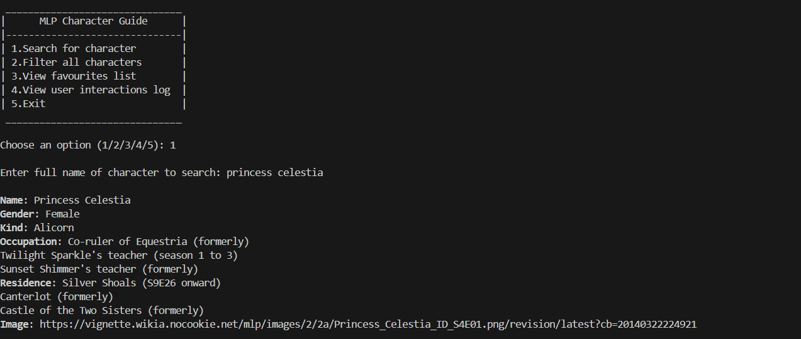
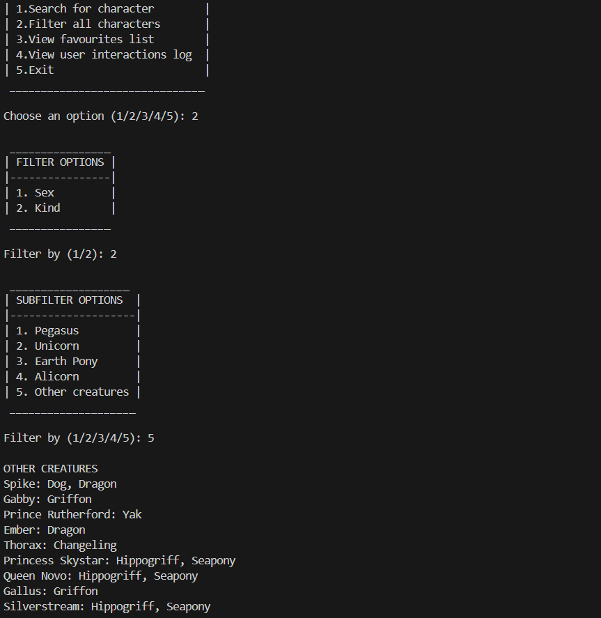
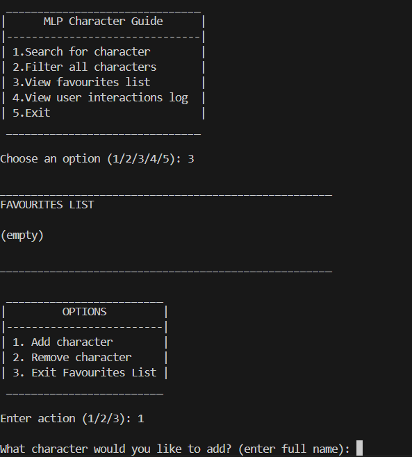
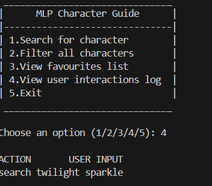
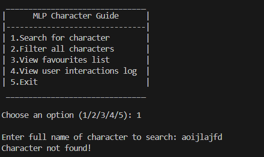
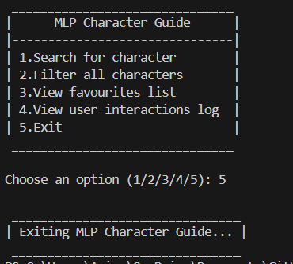

However, there is an error in both the add_character() and remove_character() functions that can be seen in the screenshot below that causes the system to crash, which negatively impacts this systems reliability and functionality. Apparently log_df isn't properly defined, so that will be the immediate next step I will need to take for improving this interface and ensuring it aligns with functional requirements. 
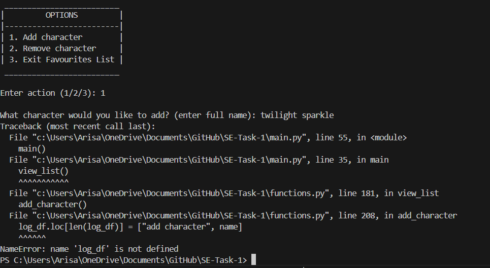

On the other hand, since my first prototype, the UX has been greatly improved and the non-functional requirements has been addressed adequately. The implementation of boxes and line breaks has created a clearer structure, and the use of time.sleep(x) has allowed for a streamlined user experience. One small improvement that can be made for the final interface is the images of characters should be properly displayed in the terminal rather than a URL link to the image, as it just makes information less accessible just within the interface. The purpose of this application is for users to be able to access all general character information WITHIN the application, so the system should be able to display the image within VSC for the sake of the users' convenience.

Finally, as the record_actions() function has been created to preserve user interactions, I want to further clean up the UX by importing the os module and clearing the screen after users are done with an action. This will overall promote a more coherent system structure and make the program more easier to navigate for users, boosting accessibility and efficiency.

## Testing and Debugging
### Student Feedback #1 - Yuna Shin
Everything mentioned in the functional and nonfunctional requirements was displayed into the program. The README.md clearly portrayed everything needed to understand how to use the program and the requirements.txt file had all the modules included. The information outputed was easy to skim through and had everything a my little pony fan would want to look for. The various filters were easy to understand and navigate through and it was very simple to view, add and remove from my list. However, it would have been nice if my list wasn't posted everytime I wanted to add or remove from it and if the past inputs were to stay in the terminal so that I wouldn't have to re-enter my previous inputs or check the interaction log continuously - which was a really nice addition. Since I only have one body, it would be hard to determine the functionality of the load testing. Overall, the outputs were really clean and pretty and made it easier and more pleasing to read. 

### Student Feedback #2 - Isabella Usacheva
- feedback based on functional and nonfunctional requirements, response time, load testing and the suitability of the requirements.txt and README.md file

## Final Evaluation
### Evaluate the current functionality of the program in terms of how well it addresses the functional and non-functional requirements
Functionally, the project meets the requirements for providing users with a clear list of action options and a text field for user input. Additionally, the system is able to successfully fetching data from the API and displaying My Little Pony character details including the name, gender, ressidence, occupation and profile image. User interaction features outlined in the functional requirements such as searching by name, type or gender and creating a favourites list are implemented and fully functional.

From a non-functional perspective, the performance of the program is adequate, although the response time varies between 2-4 seconds and is not as fast as planned due to large requests. It is also very reliable, with the API providing accurate My Little Pony data and the system accurately retrieving and displaying it to users. In terms of error processing, the system correctly identifies invalid user inputs and API issues, returning specific error messages without crashing, which was made evident during peer testing. However, some actions such as the search_name function do not allow users to retry and returns them to the main menu, which negatively impacts the user experience. Furthermore, the code is well structured and with several functions, allowing for easier maintenance and modification. Likewise, the user experience is also well structured and has clear boxes and spacing with concise and informational options, which all contribute to easier navigation and interaction. Although the orderly and distinct format of the application together with the comprehensive instructions in the README file do help promote accessibility, the program is overall not highly accessible in my opinion as in my non-functional requirements I stated 'accessible to a range of abilities'. This application is not friendly to people with disabilities nor does it really cater to general impairements like poor vision as the text during this experience is quite small and compact, which was pointed out by user feedback. Finally, the security of this program is quite minimal as no sensitive data or API key is required for the program to function, though considerations such as safe data handling are not properly considered.

Overall, the program generally aligns with the requirements for this project with key gaps identified in security and accessibility, which should be addressed in future to improve overall system success and quality.

### Discuss areas for improvement or new features that could be added
Through peer feedback, I have gained valuable insight on the usability of this application and how the user experience can overall be improved. Users find that the clear screen function was actually counterintuitive to my actual intention (to enhance usability) and made it more difficult for users to utilise the application to its fullest extent as my peers stated they wished they could keep previous inputs and outputs in the terminal so they wouldn't have to re-enter them to check while they were researching about specific characters. Similarly, I believed the reprinting of the Favourites List after each 'add' or 'remove' action could help keep users updated on changes to the list and also simulate as a kind of basic version of for example, a spotify playlist. However, users found the constant refreshing of the Favourites List to be persistent and not needed, so in future I would alter it so it loops the Favourites List menu with viewing the list as an option. Overall, a deeper consideration of user needs could have taken place over accomodating to my own beliefs on what would make a better, more 'efficient' system, and features such as the clear screen and reprinting the favourites list should be removed or made optional to users for a more successful project. 

On the other hand, if I were to speculate into any future updates and features that could enhance this user interface, I would like to explore more high-quality, interactive visualisation methods as term-image produces a quite pixelated and low quality visualsation. Additionally, to ensure an optimised maintenance for this project, I would implemement automated dependency updates and incorporate load testing to promote better concurrent usage so multiple users could interact with the application at once.


### Evaluate how the project was managed throughout its development and maintenance, including your time management and how challenges were addressed during the software development lifecycle
I believe my project was overall managed efficiently and responsibly throughout its development and maintenance. In terms of my requirements, I outlined them clearly and measurably, which made later stages such as development much easier to verify if it was going in the right direction. My time management was fairly good, where I made consistent commits from when the task was assigned toward the due date and there was not an excessive amount of last minute committing. Each task for the project was completed more or so within the time frames I created on the Gantt Chart, so my milestones were realistic to my working pace, although there was a need for editing later on to ensure consistency throughout both my code and my theory. Additionally, I completed two major code reviews during this project for a functioning program and a program where the API and module were integrated, and left self-comments during development on what changes needed to be made and if a function was working or not, which contributed to my efficiency and understanding of what needed to be done next. A challenge that occured during the software development lifecycle was Pillow term-image not being compatible with newer versions of Python, which I didn't identify until I tried testing on a different device from my own computer. To resolve this, I researched ways you can download older versions of Python and use it for an application and found the official website and incorporated a guide in the README.md file for people who have Python downloaded with an incompatible application to the term-image module. From this, I have ultimately learnt to do deeper research before developing code and incorporating earlier, consistent and variable testing through different devices and people throughout the project to ensure I don't run into any major issues or mistakes AFTER I've developed my application.

## Maintenance
### Explain how you would handle issues caused by changes to the API over time
Overall, I would handle issues causes by API changes over time by make sure that any breaking changes or deprecations are detected early and managed efficiently. This includes monitoring the My Little Pony API's official website, changelog and announcement channels to stay informed on any future updates. Additionally, I would implement automated unit and contract testing to validate API responses, such as checking expected data structures and any HTTPS status code changes.

To minimise the impact of these changes, I would wrap API calls in dedicated functions (abstraction layers) so changes can be handled in one place without affecting the rest of the program. Furthermore, ensuring proper error handling that can validate input and handle any unexpected or missing fields gracefully without crashing will help ensuring the program remains functional to users when these changes to the API occur. When these updates are made to the application, it should also be reflected in documentation such as the changelog or README file to notify users on any new requirements or fixes.

### Explain how you would ensure the program remains compatible with new versions of Python and libraries like requests and matplotlib
Instead of constantly updating my program to remain compatible with newer versions with Python and libraries, I can ensure my program's functionality by version locking Python and libraries employed for this application in the requirements.txt and the user instructions in the README file. For example, instead of leaving the requests library as it is in the requirements text file, I would change it to requests == 2.31.0, allowing for strict dependency management to avoid any breaking changes from newer versions. Likewise, my README already currently outlines that to run this program, they must run it under Python version 3.12, which similarly reduces compatibility issues and avoids the need for constant validation. 

However, although this approach minimises sudden compatibility risks, it is still pivotal to allocate time for maintaining and upgrading the UI to adopt newer versions to ensure long-term usability. This includes adopting continuous integration (CI) practices, allowing me to run tests across multiple Python and key dependency versions (eg. 3.10, 3.11, 3.12), identify any deprecation warnings and compatibility issues early. Additionally, comprehensive unit and integration tests, particularly for important features like the API requests and data displaying should occur constantly to ensure any updates made do not break existing functionality. 

Abstraction layers could further support mainatainability by separating core program logic from external libraries. For example, wrapping requests to the API in functions means that if the requests library changes, only that specific layer needs to be modified rather than the entire codebase. This makes the program more easily adapted to future updates while minimising the risk of widespread bugs and errors. When these updates are made to the application, it should also be reflected in documentation such as the README file to notify users on changes to supported Python versions and the necessary requirements to run the program. 

### Describe the steps you would take to fix a bug found in the program after deployment

To fix a bug found in the program after deployment, I would take structured and cautionary approach to resolve the issue safely without creating new ones. Firstly, I would identify the severity of the bug to determine its urgency and whether it can be fixed immediately or if I need to wait until more resources are available. I would also notify the development team (if this were a real-life project) and reproduce a test environment for developers, as well as checking if user or data integrity is made vulnerable so any stakeholders can be notified as well. 

Next, I would document all relevant details both manually through screenshots and videos or through a bug reporting tool, including factors like the steps taken to reproduce the bug, the environment details, the expected vs actual results, and an identification of why any automated tests did not catch the bug. This overall helps pinpoint the root cause of the bug so that it can be fixed appropriately. Additionally, I would then isolate the bug by isolating variables in the codebase, analysing and logs and tools like git bisect to capture the failing behaviour. The use of targeted testing overall speeds up feedback loops, increasing efficiency and minimising extra costs. 

Then, I would implement a minimal, quick fix that has been both manually and automatically tested thoroughly to ensure any new features created do not create new bugs, and this would be deployed and monitored for any regression or related issues post deployment. Finally, a post-mortem analysis on the root cause, the corrective actions and preventive measures taken (including any updated automated tests) will be made to prevent the same error from occuring again and providing valuable insight for fixing any similar future bugs.

### Outline how you would maintain clear documentation and ensure the program remains easy to update in the future

Clear documentation is crucial for an organised, streamlined workflow and provides as a permanent record and reference point for any requirements, goals, errors and updates in a project. I would document key aspects of the project, including the project requirements, scopes, success criteria, as well as aspects such as overall architecture, deployment steps, environmental variables and common troubleshooting scenarios to ensure developers can quickly understand the general project situation. These documentation files would be kept close to the code in the repository through a Markdown file to optimise easy referencing and version control alongside the code during the development stage. Furthermore, my documentation would also include a comprehensive README file that is up to date with any instructions on installations, dependencies, usage, as well as any set up steps for installing the compatible Python version. The README file overall guarantees that both users and other developers interacting with your application have a complete understanding of the program and how to run it.

In terms of the code, it should be modular, consisting of multiple functions to reduce redundant codeblocks, and well-structured to ensure easy updating of features without affecting the whole codebase. Inline comments and docstrings will focus on outlining any clarifications or reasoning for specific design choices in any functions, parameters and other important logic for increased understanding and communication with other future developers. Finally, I would maintain an up-to-date changelog and release notes to track important updates and highlight any breaking changes, making it easier to manage future upgrades.


