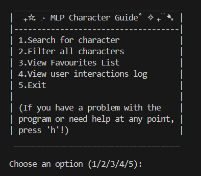
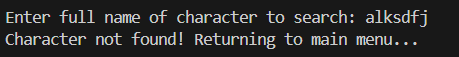
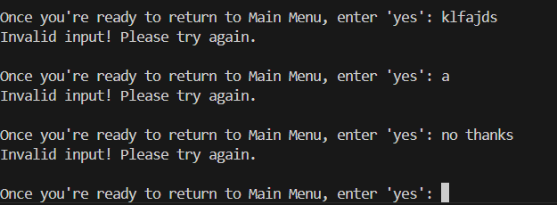

# My Little Pony: Character Guide API
#### Arisa Komatsu 10SE Task 1

This user interface is based on the animated series 'My Little Pony: Friendship is Magic' and its soul purpose is to allow people within the fandom and those wanting to get to know the series to familiarise themselves with characters from MLP. It acts as an interactive encyclopedia of all featured characters, where users can readily access MLP information without the need of constant web surfing.
## Requirements
To run this program, you need the following dependencies:
- A Python version below 3.13 (If you have a newer version then this, see Install Dependencies)
- 'requests' to make HTTP requests to the My Little Pony API.
- 'pandas' for data cleaning/filtering.
- 'term-image' for image visualisation

## Install Dependencies
1. Before going into VSC to install dependencies, if you have a Python version above 3.13, you will need to go to the following website to install Python 3.12.0:
https://www.python.org/downloads/release/python-3120/?utm_source=copilot.com

2. Scroll down the website and go to the subheading 'Files' and download the file compatible for your device.

3. Open the file you have downloaded and click for this version of Python to begin downloading.

1. Once you have a compatible Python version, open Visual Studio Code and go to the top left of your VSC and click 'Terminal'


2. After clicking terminal, you should see an option at the very top called 'New Terminal'. Click it and a new terminal should pop up at the bottom of your screen.


3. Paste the following text into your terminal and it will download all the libraries needed for functioning this API project.

```py -3.12 -m pip install -r requirements.txt```


## How to Navigate
The MLP Character Guide can be accessed through running the file named 'main.py' after all dependencies have been confirmed and installed. This can be done by the following command in terminal:
```py -3.12 main.py```

After clicking the button, a new terminal should pop up on your screen, which you can make full screen, with the following menu of actions the user can take. You can select the action of your choosing by typing its correlating number (1/2/3/4/5).


For any actions where the system wants you to enter a character name(lowercase or uppercase does not matter in this case), remember to enter their full name (eg. type Princess Celestia, not Celestia) and check your spelling is correct before pressing enter. Otherwise, the system will respond with an error message stating something like the following screenshot:


After each successful action, the system will ask you if you are ready to return to the Main Menu/Favourites List loop. As seen below, this question will constantly be displayed until the you enter 'yes', so leave it until you are done with your chosen action before entering an input.


## Technologies Used
The MLP Character Guide was developed using Python and several supporting libraries. The requests library was employed to interact with the API, pandas for data handling and logging interactions, and term-image to display images in the terminal. As development was carried out in Visual Studio Code, some built-in modules such as datetime, json, time and os were also used for logging, processing API data, and creating a streamlined UX (respectively).
