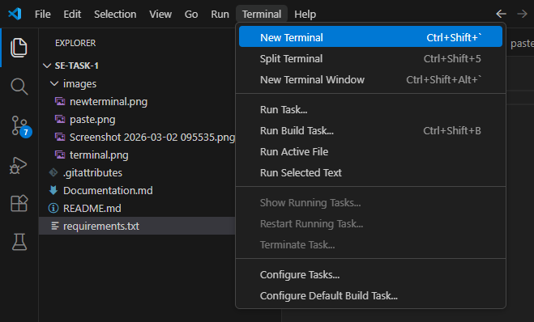
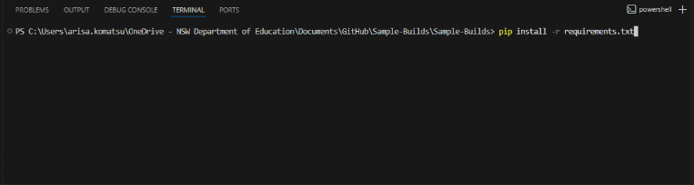

# My Little Pony: Character Guide API
#### Arisa Komatsu 10SE Task 1

Description (2-3 sentences)(what project does, why it exists, and the problems it solves)

This user interface is based on the animated series 'My Little Pony: Friendship is Magic' and its soul purpose is to allow people within the fandom and those wanting to get to know the series to familiarise themselves with characters from MLP. It acts as an interactive encyclopedia of all featured characters, where users can (), ultimately (what problem solve?)

## Requirements
To run this program, you need the following dependencies:
- 'requests' to make HTTP requests to the () API.
- 'pandas' for 
- 'numpy' for data manipulation.

## Install Dependencies
1. Go to the top left of your VSC and click 'Terminal'


2. After clicking terminal, you should see an option at the very top called 'New Terminal'. Click it and a new terminal should pop up at the bottom of your screen.


3. Paste the following text into your terminal and it will download all the libraries needed for functioning this API project.

```pip install -r requirements.txt```


## How to Navigate

## Technologies Used
- Python 
- json (in-built to python)
- pandas
- numpy